<div align="center">

# Churn Prediction & Retention

**Predição de cancelamento e retenção de clientes com Clustering + Machine Learning**

---

André Luiz Vicente Silva · Fernando Santos de Almeida · João Henrique Batista Junior

*Gustavo Prado Oliveira · Clarimundo — Projeto Integrador Acadêmico · 2026*

</div>

---

## Sumário

1. [Resumo Executivo](#1-resumo-executivo)
2. [Dataset e Pré-processamento](#2-dataset-e-pré-processamento)
3. [Clusterização de Clientes](#3-clusterização-de-clientes)
4. [Predição de Churn](#4-predição-de-churn)
5. [Sistema de Retenção](#5-sistema-de-retenção)
6. [Conclusão e Aprendizados](#6-conclusão-e-aprendizados)
7. [Apêndice](#7-apêndice)

---

## 1. Resumo Executivo

Pipeline completo de ciência de dados sobre o **Telco Customer Churn** (7.043 clientes, ~27% de churn), integrando **Agrupamento de Dados** e **Inteligência Computacional**.

| Etapa | Resultado-chave |
|---|---|
| Clusterização | 2 perfis: Cluster 0 com **31,8% de churn** vs. Cluster 1 com **8,0%** |
| Melhor modelo | **Regressão Logística** — F1 CV = 0,629 · AUC CV = 0,844 |
| Cluster como feature | Ganho marginal ΔF1 ≤ +0,006 (informação redundante) |
| Sistema de retenção | **3.162 clientes em risco** (threshold 0,45) · 5 tipos de ação personalizada |

---

## 2. Dataset e Pré-processamento

**Dataset:** [Telco Customer Churn](https://www.kaggle.com/datasets/blastchar/telco-customer-churn) — 7.043 clientes · 21 atributos originais · desbalanceamento ~73%/27%.

**Tratamentos realizados:** conversão de `TotalCharges` para numérico, encoding binário/ordinal, engenharia de atributos. Base final: **7.043 × 35 colunas**.

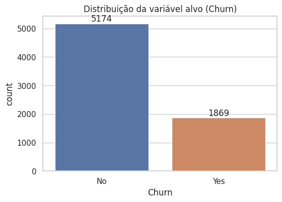
*~73% dos clientes permanecem · ~27% cancelam.*

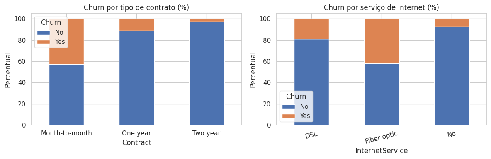
*Contratos mensais e fibra óptica concentram as maiores taxas de cancelamento.*

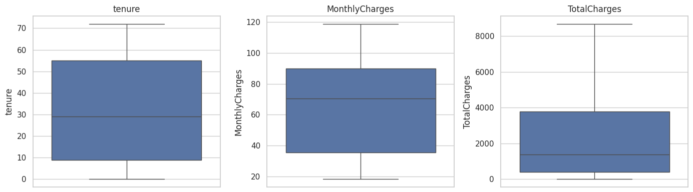
*Outliers em `tenure`, `MonthlyCharges` e `TotalCharges` mantidos por serem plausíveis.*

**Hipóteses confirmadas:** contratos mensais e fibra óptica são os maiores drivers de churn. `TotalCharges` é altamente colinear com `tenure × MonthlyCharges`.

---

## 3. Clusterização de Clientes

**Atributos usados (7):** `tenure`, `MonthlyCharges`, `Contract`, `InternetService`, `TechSupport`, `OnlineSecurity`, `PaymentMethod` — excluindo `Churn` (data leakage) e `TotalCharges` (colinear).

### K-Means (K=2)

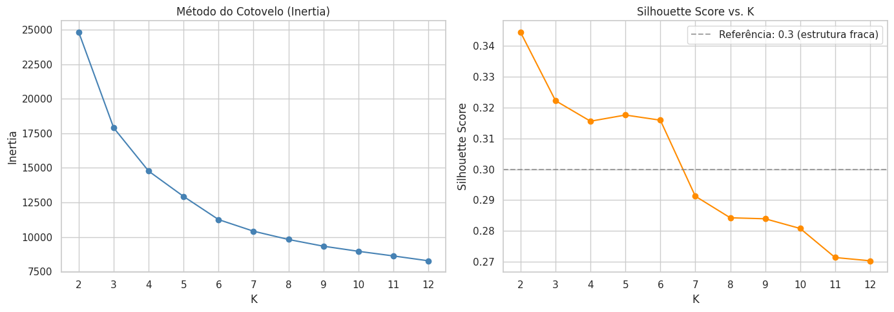
*K=2 selecionado pelo maior Silhouette Score (0,344).*

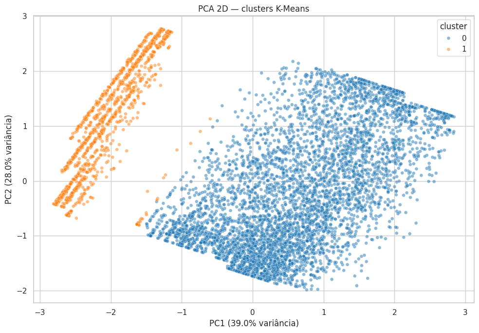
*Projeção PCA dos 7.043 clientes coloridos por cluster.*

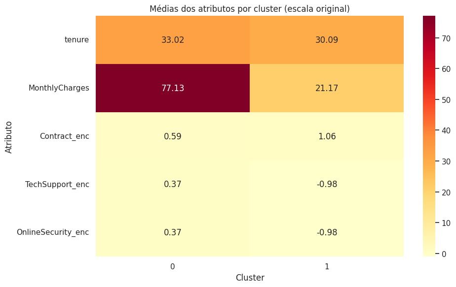
*Cluster 0: alto gasto + contrato mensal + fibra. Cluster 1: baixo gasto + contrato longo + sem internet.*

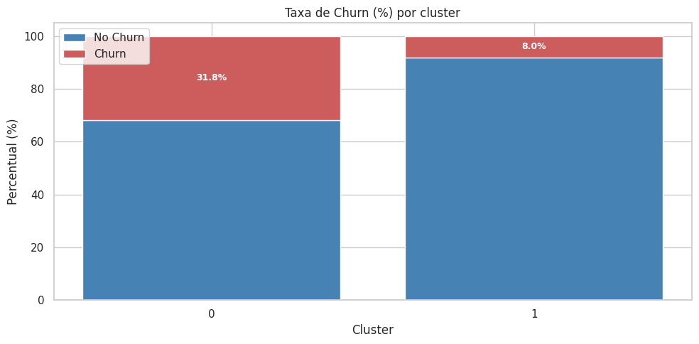
*Cluster 0 concentra **31,8% de churn** vs. **8,0%** no Cluster 1 — diferença de ~4×.*

| Cluster | Rótulo | Tamanho | Churn | Gasto mensal | Contrato | Internet |
|---|---|---|---|---|---|---|
| **0** | Insatisfeito com serviços | 5.486 (77,9%) | **31,8%** | R$ 77,10 | Mensal | Fibra óptica |
| **1** | Econômico estável | 1.557 (22,1%) | **8,0%** | R$ 21,20 | 2 anos | Sem internet |

### DBSCAN vs. K-Means

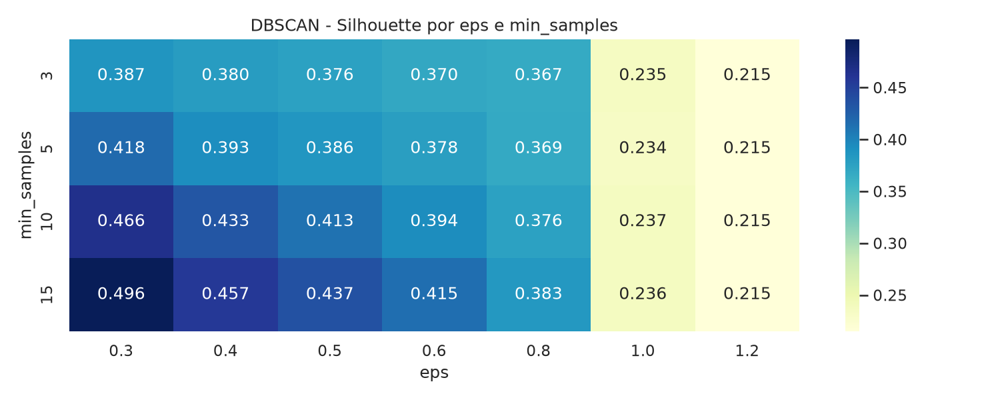
*Melhor configuração DBSCAN: eps=0,8, min_samples=3 → 108 micro-clusters.*

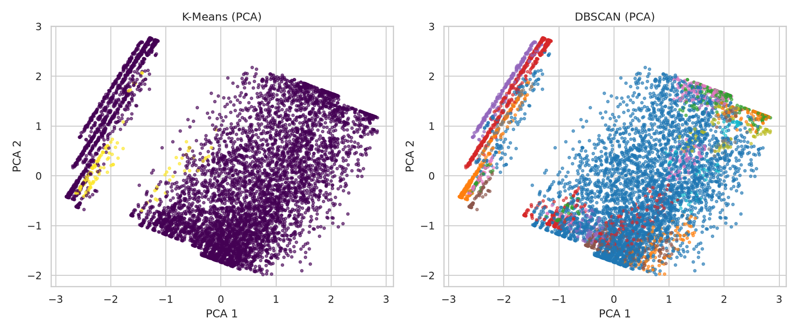
*K-Means (2 clusters interpretáveis) vs. DBSCAN (108 micro-clusters).*

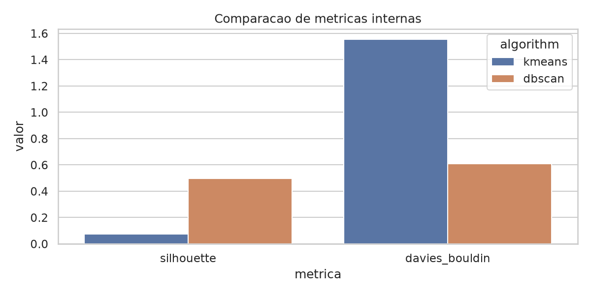

| Métrica | K-Means (K=2) | DBSCAN (eps=0,8) | Vencedor |
|---|---|---|---|
| Silhouette | 0,344 | **0,364** | DBSCAN |
| Davies-Bouldin | **1,146** | 1,299 | K-Means |
| Calinski-Harabasz | **3.104,6** | 544,0 | K-Means |
| Interpretabilidade | **Alta** | Baixa | K-Means |

**Decisão:** mantido K-Means K=2 — DBSCAN gerou 108 micro-clusters impraticáveis para ações de retenção.

---

## 4. Predição de Churn

**Estratégia:** divisão 80/20 estratificada · SMOTE apenas no treino · Stratified K-Fold (k=5).

### Resultados — Validação Cruzada (5-fold)

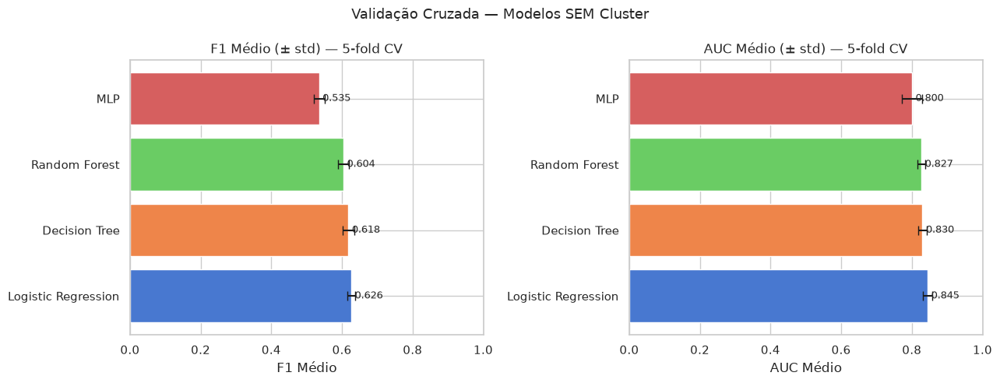
*Regressão Logística lidera em F1 e AUC consistentemente.*

| Modelo | F1 CV | AUC CV |
|---|---|---|
| **Regressão Logística** | **0,629** | **0,844** |
| MLP | 0,569 | 0,808 |
| Árvore de Decisão | 0,577 | 0,813 |
| Random Forest | 0,558 | 0,824 |

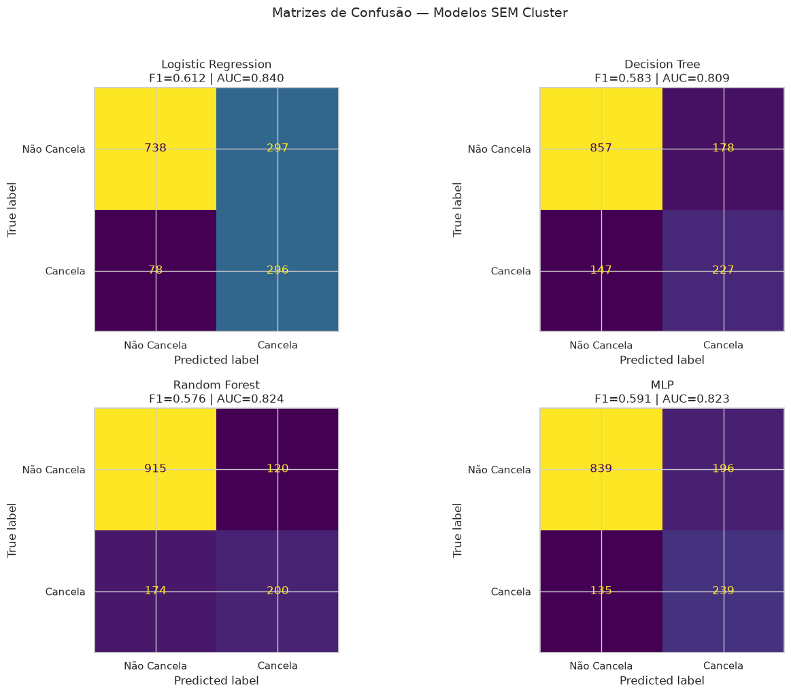

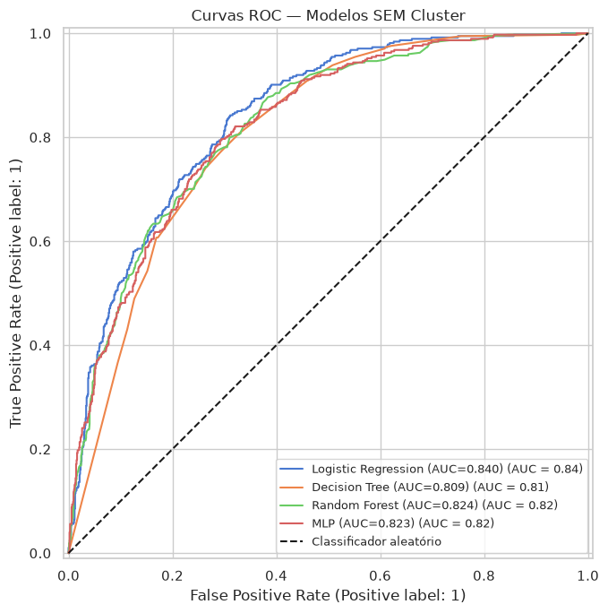
*Todos superam AUC > 0,80 · Regressão Logística lidera com AUC = 0,840.*

### Importância de atributos

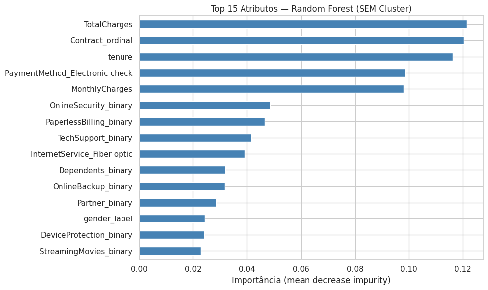
*`tenure`, `MonthlyCharges`, contrato mensal e fibra óptica lideram.*

### Cluster K-Means como feature

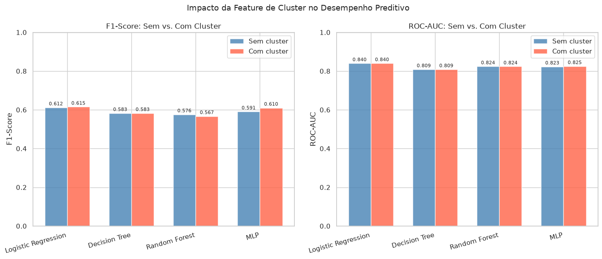

| Modelo | ΔF1 | ΔAUC |
|---|---|---|
| Regressão Logística | +0,005 | +0,000 |
| Random Forest | +0,006 | +0,001 |
| MLP | **−0,007** | +0,000 |

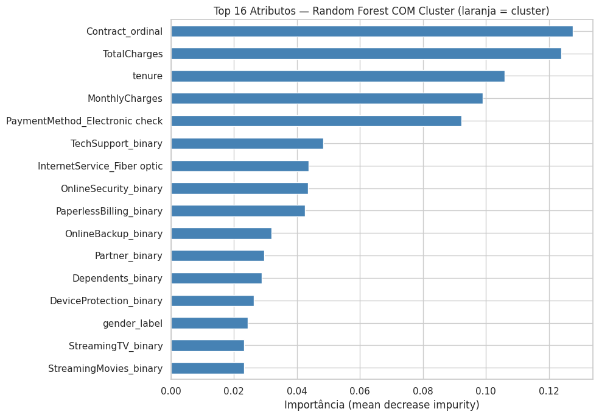
*`kmeans_cluster` ficou em 23º lugar (último) — informação redundante das features originais.*

**Conclusão:** o cluster não adiciona poder preditivo relevante, pois as features de segmentação já estão presentes no modelo.

**Modelo persistido:** `models/churn_lr_baseline.joblib`

---

## 5. Sistema de Retenção

### Ajuste de threshold

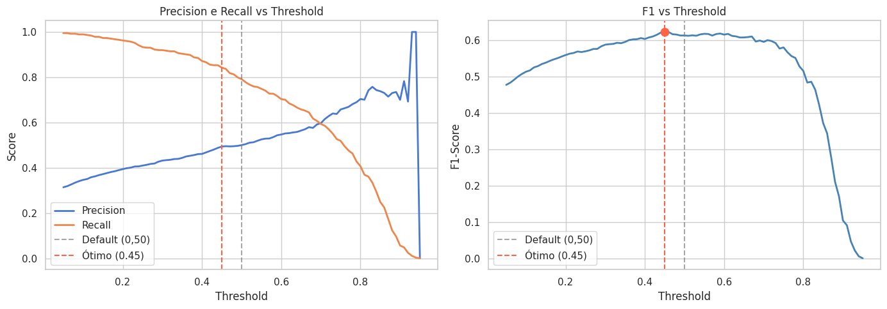
*F1 máximo em threshold = 0,45.*

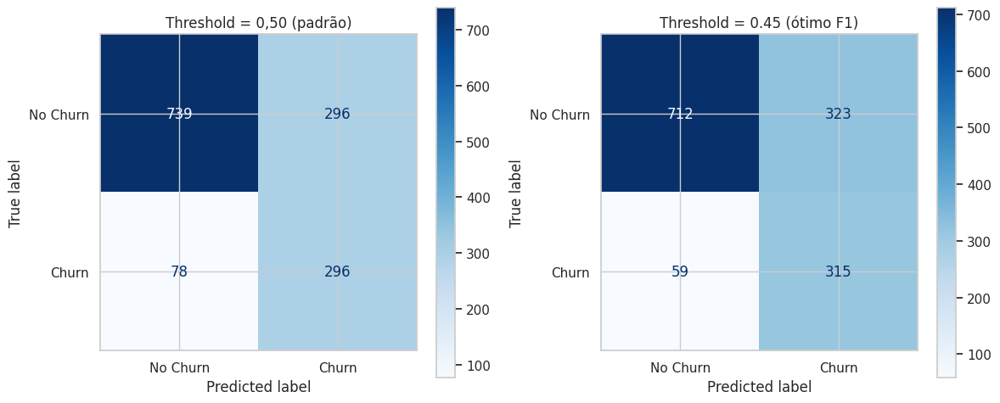

| Threshold | F1 | Recall (Churn) | Precision |
|---|---|---|---|
| 0,50 (padrão) | 0,613 | 79,1% | 0,500 |
| **0,45 (ótimo)** | **0,623** | **84,2%** | 0,493 |

Com threshold 0,45: **3.162 clientes em risco** identificados (44,9% da base).

### Lógica de recomendação

```
Cliente → Prob ≥ 0,45?
    ├── Sim → Cluster 0 → Contato prioritário (upgrade contrato + suporte gratuito)
    │         Cluster 1 → Retenção preventiva
    └── Não → Cluster 0 → Desconto personalizado
              Cluster 1 → Upsell de serviço
```

### Resultados operacionais

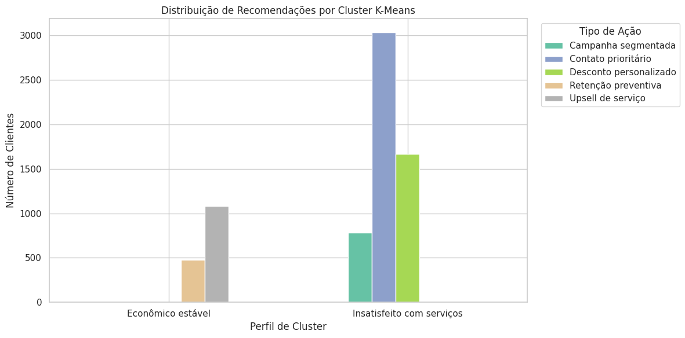
*Cluster 0 concentra as ações de contato prioritário.*

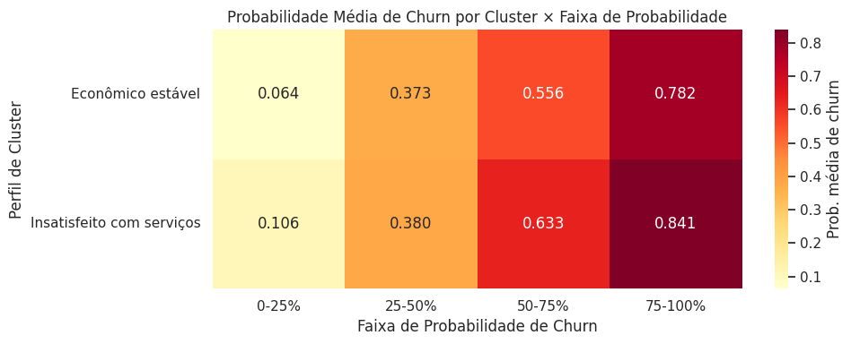
*Cluster 0 domina as faixas de probabilidade mais altas.*

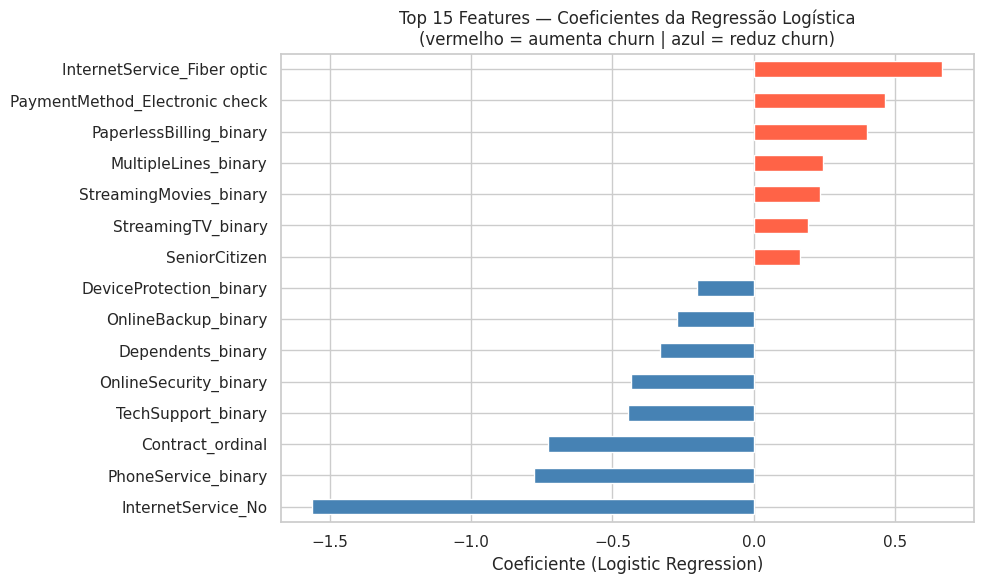
*Contrato mensal, fibra óptica e pagamento eletrônico aumentam churn · tenure e contratos longos reduzem.*

**Saída:** `reports/recommendations.csv` — 7.043 linhas com probabilidade, cluster, prioridade e ação recomendada.

---

## 6. Conclusão e Aprendizados

### Objetivos atingidos

| Objetivo | Resultado |
|---|---|
| Base limpa e EDA | 7.043 clientes · 35 features · hipóteses confirmadas |
| Segmentação | 2 perfis interpretáveis (K-Means) · comparação com DBSCAN |
| Predição | Regressão Logística: F1 CV = 0,629 · AUC CV = 0,844 |
| Experimento cluster | Ganho marginal ΔF1 ≤ +0,006 confirmado |
| Sistema de retenção | 3.162 em risco · 5 ações personalizadas |

### Principais aprendizados

1. **Regressão Logística supera modelos complexos** — as relações no Telco Dataset são aproximadamente lineares (F1 CV 0,629 vs. RF 0,558).
2. **Clustering personaliza, não prediz** — K-Means não melhora a predição, mas é essencial para direcionar ações de retenção por perfil.
3. **Threshold padrão é subótimo** — em churn, falso negativo (cliente cancela sem ação) custa mais que falso positivo; threshold 0,45 aumentou Recall de 79,1% → 84,2%.
4. **DBSCAN é tecnicamente superior, mas impraticável** — 108 micro-clusters não são acionáveis para regras de negócio.
5. **Dois drivers dominantes:** contrato mensal e fibra óptica aparecem consistentemente em EDA, clustering, predição e coeficientes do modelo.

### Limitações e próximos passos

- Dados estáticos (sem temporalidade) — incorporar séries temporais de uso/billing
- K=2 simplifica a estrutura — explorar K maior ou algoritmos com número automático de clusters
- Recomendações por regras estáticas — implementar validação A/B e feedback loop
- Modularizar notebooks para produção (`src/`) e otimizar hiperparâmetros com GridSearchCV

---

## 7. Apêndice

### Artefatos produzidos

| Artefato | Caminho |
|---|---|
| Base limpa | `data/processed/telco_clean.csv` |
| Base com clusters | `data/processed/telco_with_clusters.csv` |
| Modelo K-Means | `models/kmeans_model.joblib` |
| Modelo preditivo | `models/churn_lr_baseline.joblib` |
| Recomendações | `reports/recommendations.csv` |

### Execução

```bash
git clone https://github.com/andrelvicente/churn-prediction-and-retention.git
cd churn-prediction-and-retention
python3 -m venv .venv && source .venv/bin/activate
pip install -r requirements.txt
# Salvar Telco-Customer-Churn.csv em data/raw/
jupyter notebook notebooks/
# Ordem: 01_eda → 02_clustering → 03_clustering_advanced → 04_churn_prediction → 05_recommendations
```

### Referências

- [Telco Customer Churn Dataset — Kaggle](https://www.kaggle.com/datasets/blastchar/telco-customer-churn)
- [Scikit-learn Documentation](https://scikit-learn.org/)
- [imbalanced-learn (SMOTE)](https://imbalanced-learn.org/)

---

<div align="center">

*Projeto Integrador — Agrupamento de Dados + Inteligência Computacional · 2026 · Licença [MIT](../LICENSE)*

</div>
